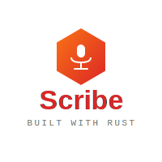

<p align="center">
  
</p>

<h1 align="center">Scribe</h1>

<p align="center">Fast, lean, Rust-based voice dictation system</p>

## Status


**Beta Release** - Core functionality complete and stable. All major features implemented and tested.

## Features

- **Fast**: Compiled binary, <500ms startup time
- **Lean**: <50MB memory footprint
- **High Quality**: Whisper-based transcription (local or API)
- **Tray-Only UI**: Minimal, non-intrusive interface for Xmonad/Polybar
- **IPC Control**: Unix socket interface for XMonad integration
- **Smart VAD**: WebRTC voice activity detection with scientifically-tuned parameters

## Installation

### Prerequisites

- System dependencies:
  - **ALSA**: `libasound2-dev` (Debian/Ubuntu) or `alsa-lib` (Arch)
  - **dotool**: Text injection binary ([installation guide](https://sr.ht/~geb/dotool/))
  - **D-Bus**: For system tray and notifications (usually pre-installed)

### Option 1: AUR Package (Arch Linux - Recommended)

```bash
# Clone the repository
git clone https://github.com/abjoru/scribe
cd scribe
makepkg -si
```

The AUR package handles:
- Binary installation to `/usr/bin/scribe`
- Default config to `/usr/share/scribe/default.toml`
- Systemd service to `/usr/lib/systemd/user/scribe.service`
- udev rules for uinput permissions

Post-install steps (shown after installation):
1. Add your user to 'input' group: `sudo usermod -aG input $USER`
2. Copy default config: `mkdir -p ~/.config/scribe && cp /usr/share/scribe/default.toml ~/.config/scribe/config.toml`
3. Edit config: `$EDITOR ~/.config/scribe/config.toml`
4. Log out and back in (for group change)
5. Run: `scribe`

Optional: Enable systemd service: `systemctl --user enable --now scribe`

### Option 2: Manual Installation Script

```bash
# Clone the repository
git clone https://github.com/abjoru/scribe
cd scribe

# Run install script (builds and installs to ~/.local/bin)
./install.sh
```

The install script:
- Builds optimized release binary
- Installs to `~/.local/bin/scribe`
- Sets up config at `~/.config/scribe/config.toml`
- Installs systemd user service
- Sets up udev rules and adds you to 'input' group

Post-install: Log out and back in for group changes to take effect.

### Option 3: Building from Source

```bash
# Clone the repository
git clone https://github.com/abjoru/scribe
cd scribe

# Install system dependencies
# Arch:
sudo pacman -S alsa-lib dotool

# Debian/Ubuntu:
sudo apt install libasound2-dev

# Build release binary
cargo build --release
strip target/release/scribe

# Install manually
sudo cp target/release/scribe /usr/local/bin/

# Create config directory
mkdir -p ~/.config/scribe
cp config/default.toml ~/.config/scribe/config.toml
```

### Systemd Service (Optional)

Run scribe automatically on login:

```bash
# Enable and start the service
systemctl --user enable --now scribe

# Check status
systemctl --user status scribe

# View logs
journalctl --user -u scribe -f
```

**Using OpenAI API with systemd:**

If using the OpenAI API backend, you need to provide the API key via an EnvironmentFile:

```bash
# 1. Create API key environment file
echo 'OPENAI_API_KEY=sk-your-key-here' > ~/.config/scribe/api-key.env
chmod 600 ~/.config/scribe/api-key.env

# 2. Copy and customize the systemd service
mkdir -p ~/.config/systemd/user
cp /usr/lib/systemd/user/scribe.service ~/.config/systemd/user/

# 3. Edit the service file to add EnvironmentFile
# Add this line in the [Service] section:
# EnvironmentFile=%h/.config/scribe/api-key.env

# 4. Reload systemd and start service
systemctl --user daemon-reload
systemctl --user enable --now scribe
```

Example modified service file:
```ini
[Service]
EnvironmentFile=%h/.config/scribe/api-key.env
ExecStart=/usr/bin/scribe
Restart=always
RestartSec=5
```

## Development Setup

### Prerequisites

- Rust 1.70+ (2021 edition)
- System dependencies (see Installation section above)

### Development Build

```bash
# Set up git hooks (for contributors)
./setup-hooks.sh

# Build debug version
cargo build

# Run directly
cargo run
```

### Development Tools

- **Format**: `cargo fmt`
- **Lint**: `cargo clippy --all-targets --all-features`
- **Test**: `cargo test --all-features`
- **Check**: `cargo check`

Pre-commit hooks will automatically run these checks.

## Usage

### Starting the Daemon

```bash
# Start scribe daemon (runs in background)
scribe
# Or explicitly:
scribe daemon

# With debug logging
RUST_LOG=debug scribe
```

### Controlling Recording

```bash
# Toggle recording on/off (recommended for hotkey)
scribe toggle

# Or use explicit commands
scribe start   # Start recording
scribe stop    # Stop recording and transcribe
scribe cancel  # Cancel recording without transcription (discards audio)
scribe status  # Get current status (idle/recording/transcribing)
```

**Note:** `cancel` only works while actively recording. Use it to abort accidental recordings without wasting transcription resources.

### Managing Whisper Models

```bash
# List installed models
scribe model list

# List available models for download
scribe model list-available

# Download a specific model
scribe model download base

# Set active model (updates config)
scribe model set base

# Show model information
scribe model info base

# Remove a model
scribe model remove tiny
```

### Workflow

1. Start the daemon: `scribe` or `scribe daemon`
2. Press your hotkey to toggle recording (e.g., `scribe toggle`)
3. Speak naturally
4. Press hotkey again to stop
5. Transcribed text is automatically typed where your cursor is

## Configuration

### Config File

User config: `~/.config/scribe/config.toml`
Default config: See `config/default.toml`

If no user config exists, scribe uses built-in defaults.

#### Transcription Backends

Scribe supports two transcription backends:

**1. Local Backend (Whisper via Candle)**

Uses Hugging Face's Candle framework for pure Rust ML inference. Models are automatically downloaded from Hugging Face Hub on first use.

```toml
[transcription]
backend = "local"
model = "base"          # Options: tiny, base, small, medium, large
device = "auto"         # Options: cpu, cuda, auto
language = "en"         # 2-letter ISO code or empty for auto-detect
initial_prompt = ""     # Optional context prompt for better accuracy
```

Supported models:
- `tiny` - Fastest, ~75MB, good for real-time
- `base` - Balanced, ~150MB, recommended default
- `small` - Better accuracy, ~500MB
- `medium` - High accuracy, ~1.5GB
- `large` - Best accuracy, ~3GB

Models are cached in `~/.cache/huggingface/hub/` and reused across runs.

**2. OpenAI API Backend**

Uses OpenAI's Whisper API for transcription (requires API key).

```toml
[transcription]
backend = "openai"
api_key_env = "OPENAI_API_KEY"
api_model = "whisper-1"
api_timeout_secs = 30
```

Set your API key:
```bash
export OPENAI_API_KEY="your-key-here"

# Or add to ~/.bashrc or ~/.zshrc for persistence
echo 'export OPENAI_API_KEY="sk-..."' >> ~/.bashrc
```

### Audio Settings

```toml
[audio]
sample_rate = 16000  # Hz (16000 recommended for Whisper)
device = null        # null = auto-detect, or specify device name
```

List available audio devices:
```bash
arecord -L
```

### VAD (Voice Activity Detection)

```toml
[vad]
aggressiveness = 2      # 0-3 (higher = more aggressive filtering)
silence_ms = 900        # Stop after this much silence
min_duration_ms = 500   # Minimum recording length
skip_initial_ms = 0     # Skip initial ms (0 for IPC, 150 for hotkey noise)
```

### Text Injection

```toml
[injection]
method = "dotool"    # Only dotool supported currently
delay_ms = 2         # Delay between characters (0-100ms)
```

### Notifications

```toml
[notifications]
enable_status = true    # Show recording/transcribing status
enable_errors = true    # Show error notifications
show_preview = true     # Show transcribed text preview
preview_length = 50     # Characters to show in preview
```

### Logging

```toml
[logging]
level = "info"   # debug, info, warn, error
file = null      # Optional log file path
```

Or override with environment variable:
```bash
RUST_LOG=debug scribe
```

## Architecture

```
scribe/
├── src/
│   ├── audio/          # Audio capture + VAD
│   ├── transcription/  # Whisper (local/API)
│   ├── ipc/            # Unix socket server/client
│   ├── input/          # Text injection (dotool)
│   ├── config/         # TOML configuration
│   ├── tray/           # System tray icon
│   └── notifications/  # Desktop notifications
```

## XMonad Integration

Add to your `xmonad.hs`:

```haskell
import XMonad
import XMonad.Util.EZConfig (additionalKeysP)

main = xmonad $ def
    `additionalKeysP`
    [ ("M-S-v", spawn "scribe toggle")   -- Super+Shift+V to toggle
    , ("<F9>", spawn "scribe toggle")     -- Or F9 to toggle
    , ("S-<F9>", spawn "scribe cancel")   -- Shift+F9 to cancel (abort)
    ]
```

**Tip:** Using the same key with Shift modifier (e.g., F9 vs Shift+F9) provides an intuitive way to cancel accidental recordings.

Start scribe automatically on login by adding to `~/.xmonad/startup-hook`:
```bash
scribe &
```

## Polybar Integration

Show scribe status in Polybar:

```ini
[module/scribe]
type = custom/script
exec = scribe status 2>/dev/null || echo "offline"
interval = 1
format = <label>
format-prefix = "🎤 "
click-left = scribe toggle
```

## System Tray

Scribe provides a system tray icon with visual feedback:
- **Gray**: Idle
- **Red**: Recording
- **Blue**: Transcribing

Right-click menu:
- Toggle Recording
- Quit

## Permissions Setup

### Audio Permissions

If you get audio device errors:

```bash
# Add yourself to audio group
sudo usermod -a -G audio $USER

# Log out and back in for group change to take effect
```

### Text Injection (dotool)

dotool requires uinput access:

```bash
# Check if you have access
ls -l /dev/uinput

# If needed, add udev rule
echo 'KERNEL=="uinput", GROUP="input", MODE="0660"' | \
    sudo tee /etc/udev/rules.d/99-input.rules

# Add yourself to input group
sudo usermod -a -G input $USER

# Reload udev and log out/in
sudo udevadm control --reload-rules
```

## Troubleshooting

See [TROUBLESHOOTING.md](TROUBLESHOOTING.md) for common issues and solutions.

Quick tips:
- Enable debug logging: `RUST_LOG=debug scribe`
- Check daemon is running: `scribe status`
- Verify audio devices: `arecord -L`
- Test dotool: `echo "type hello" | dotool`
- List models: `scribe model list`
- Download missing model: `scribe model download base`

## Performance

- **Startup time**: <500ms (with local model cached)
- **Memory usage**: ~50MB idle, ~200MB during transcription (base model)
- **Transcription latency**:
  - Local (base): 2-5s per utterance
  - OpenAI API: 1-3s (network dependent)

## Development

### Running Tests

```bash
cargo test --all-features
```

### Linting

```bash
cargo clippy --all-targets --all-features
cargo fmt --check
```

### Git Hooks

Pre-commit hooks enforce formatting, linting, and tests:

```bash
./setup-hooks.sh
```

## Architecture

Detailed architecture docs in planning repository: `~/Projects/Rust dictate (scribe)/`

Key components:
- **Audio capture**: ALSA via cpal
- **VAD**: WebRTC voice activity detection
- **Transcription**: Whisper (local Candle or OpenAI API)
- **IPC**: Unix domain socket
- **Text injection**: dotool via stdin
- **UI**: System tray (StatusNotifierItem)

## Contributing

Contributions are welcome! Please:

1. Fork the repository
2. Create a feature branch
3. Install git hooks: `./setup-hooks.sh`
4. Make your changes (ensure all tests pass and clippy is happy)
5. Submit a pull request

## License

MIT License - see [LICENSE](LICENSE) for details

Copyright (c) 2026 Andreas Bjoru
